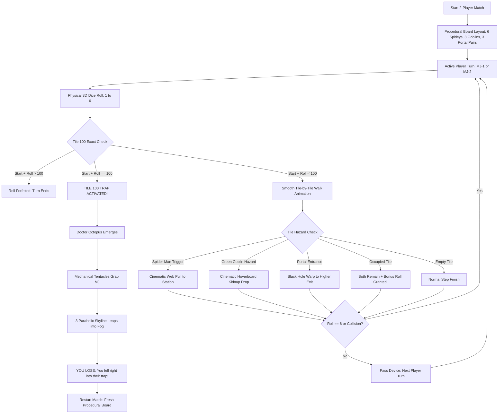

# SPIDER-MAN SNAKES & LADDERS 3D 🎯

### Basic Details
**Team Name**: SHADOWS  
**Team Members**:
- **Team Lead**: SIDHARTH D - [Your College Name]
- **Member 2**: SANJU LAKSHMAN B - [Your College Name]
- **Member 3**: N/A (2-Member Hackathon Team)

---

### Project Description
An absurdly over-engineered 3D anime browser game called **"Spider-Man Snakes & Ladders"** that has **strictly ZERO snakes and ZERO ladders**. Built for an 18-hour hackathon, two players pass-and-play locally on a single device as identical Mary Janes (distinguished strictly by hair color) navigating a 100-tile rooftop board guarded by 6 Spider-Men with mechanical gold legs, 3 hoverboard-flying Green Goblins, and 3 dark-singularity black-hole portals—only to discover that reaching Tile 100 is an inescapable Doctor Octopus kidnapping trap!

---

### The Problem (that doesn't exist)
Traditional board games like *Snakes & Ladders* have suffered for centuries from a severe, unacceptable lack of web-slinging superheroes, pumpkin bombs, dark gravitational wormholes, and tentacled supervillains ambushing players at the finish line. Millions of friendships are ruined by boring 2D flat cardboard dice rolls when what the world truly needed was an over-the-top 3D Marvel anime thriller on a Manhattan skyscraper where winning is literally a scam.

---

### The Solution (that nobody asked for)
We built a completely physical 3D anime universe in the browser! Players control identical Mary Janes (Auburn Red vs. Electric Cyan hair). 
- Instead of climbing ladders, **6 Spider-Men** visibly fire web lines across the 3D board to yank you through mid-air.
- Instead of sliding down snakes, **3 Green Goblins** tackle you onto their jet hoverboards and kidnap you downward.
- **3 Portal Pairs (6 black-hole singularities)** warp you upward into the cosmos.
- And if you have the precision to roll the exact number to reach Tile 100? **Doctor Octopus** leaps out of nowhere, grabs you with 4 mechanical cyber-claws, repeatedly bounces across the skyline into the unknown, and proclaims:  
  > **YOU LOSE — You fell right into their trap!**

---

### Technical Details

#### Technologies/Components Used

**For Software:**
- **Languages used**: JavaScript (ES6+ Modules), HTML5, Vanilla CSS3 (Custom 3D Theme & Anime Design System)
- **Frameworks used**: Vite (Next-generation lightning-fast frontend tooling)
- **Libraries used**: Three.js (WebGL 3D Engine), Canvas-Confetti
- **Tools used**: Git, GitHub, Antigravity IDE, Web Audio API (100% procedural sound synthesis — 0 external audio files)

**For Hardware:**
*N/A — Pure Software WebGL Project running on Laptop, Android, and iPhone browsers with touch & keyboard controls.*

---

### Implementation

#### For Software:

**Installation**:
```bash
# Clone the repository
git clone https://github.com/UG-SIDHARTH/sanju2.git

# Navigate to project directory
cd sanju2

# Install dependencies
npm install
```

**Run**:
```bash
# Start the local development server (runs on Port 9000)
npm run dev

# Open in browser
http://localhost:9000/
```

**Production Build**:
```bash
npm run build
npm run preview
```

---

### Project Documentation

#### For Software:

**Screenshots**:

  
*Start Screen: 2-Player single-device configuration, identical MJ models with Auburn Red & Electric Cyan hair previews, and Multiverse rules.*

  
*3D Serpentine Board: Real physical 100-tile environment atop a Manhattan rooftop with 6 Spider-Men (gold legs) and 3 Green Goblins (hoverboards).*

  
*Doctor Octopus Tile 100 Climax: Mechanical tentacles grab MJ, leaping across the skyline into the fog, triggering 'YOU LOSE - You fell right into their trap.'*

**Diagrams**:


*Architecture & Gameplay State Machine: Turn flow, physical dice rolling, hazard triggers, and Tile 100 Doctor Octopus trap.*

**For Hardware:**  
*N/A — Pure software web application.*

---

### Project Demo

**Video**:  
[Add your demo video link here]  
*Video demonstrates the 2-player pass-and-play mode, 3D dice physics, Spider-Man web pulls, Green Goblin hoverboard kidnapping, dark singularity portal warps, and the unexpected Doctor Octopus ambush at Tile 100.*

**Additional Demos**:  
- **GitHub Repository**: [https://github.com/UG-SIDHARTH/sanju2](https://github.com/UG-SIDHARTH/sanju2)  
- **Live Local URL**: `http://localhost:9000/`

---

### Team Contributions

- **SIDHARTH D**:
  - Core 3D engine integration using Three.js and custom shader/render loop.
  - Procedural board layout generation (randomizing 6 Spider-Men, 3 Goblins, and 3 Portal Pairs with distance safety constraints).
  - 3D physical dice physics simulation and unpredictable crypto-safe random generation.
  - Turn resolution logic, collision bonus roll system, and exact 100 win/forfeit mechanics.
  - Build optimization, Git architecture, and zero-latency single-device state management.

- **SANJU LAKSHMAN B**:
  - 3D character modeling and animation rigs (identical Mary Jane twins with Auburn Red vs. Electric Cyan hair).
  - 3D entity design: 6 Spider-Men with 4 articulated gold waldoes, 3 Green Goblins with spiked hoverboards.
  - Doctor Octopus Tile 100 boss rig with 4 articulated titanium tentacles and 3-stage skyline leap escape animation.
  - Manga/Anime visual theme design, responsive comic HUD overlay, and 100% procedural Web Audio synthesizer.
